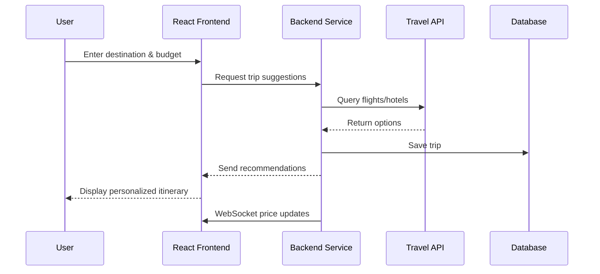

# TripTactix

[My Notes](notes.md)

TripTactix helps you plan customized, budget-friendly trips with smart travel recommendations.

## 🚀 Specification Deliverable

### Elevator pitch

Have you ever wanted to travel but felt overwhelmed by planning or worried about costs? TripTactix is your smart travel companion that turns destination dreams into affordable reality. Simply tell us where you want to go, your budget, and your travel style—whether that's adventure, relaxation, or cultural exploration—and our platform instantly generates personalized trip suggestions. Using real-time data from trusted travel APIs, we recommend the best flights, accommodations, and activities that fit your needs. Plus, stay connected with live price drop alerts through WebSocket notifications, ensuring you never miss a deal. TripTactix makes travel planning simple, affordable, and stress-free.

### Design

The following is a simple mockup showing the main user flow:

### Key features

- Secure user authentication (register/login)
- Input destination, travel dates, and budget preferences
- Real-time trip suggestions from third-party travel APIs
- Save and manage multiple trip itineraries
- Live price drop notifications via WebSocket
- Responsive design for mobile and desktop

### Technologies

I will use the required technologies in the following ways:

- **HTML**: Provides the structure for the application with pages for login, dashboard, and trip planner. Uses semantic HTML elements for accessibility.
- **CSS**: Styled with a clean, travel-themed design using soft blues and whites. Responsive layouts using Flexbox and Grid for mobile and desktop views.
- **React**: Single-page application with components for login, trip dashboard, trip planner, and trip details. Uses React Router for navigation between views.
- **Service**: Backend built with Node.js/Express providing endpoints for:
  - User registration and authentication
  - Fetching and saving trips
  - Third-party API integration (e.g., Travel Advisor API for flights/hotels)
- **Database**: Stores user accounts (hashed passwords), saved trip itineraries, and user preferences using MongoDB or PostgreSQL.
- **WebSocket**: Provides real-time price updates for saved trips, notifying users when flight or hotel prices drop.

## 🚀 AWS deliverable

- [ ] Server deployed and accessible via custom domain
- [ ] Link: [My server link](https://yourdomainnamehere.click/)

## 🚀 HTML deliverable

- [ ] HTML pages for login, dashboard, and trip planner
- [ ] Links between pages
- [ ] Text content for each section
- [ ] Images/placeholders for trip suggestions
- [ ] Login placeholder
- [ ] Database placeholder (mock trip data)
- [ ] WebSocket placeholder (price update section)
- [ ] Third-party API placeholder (travel suggestions)
- [ ] Application deployed to production environment

## 🚀 CSS deliverable

- [ ] Header, footer, and main content styling
- [ ] Navigation elements styled
- [ ] Responsive design for different screen sizes
- [ ] Application uses Bootstrap or custom CSS framework
- [ ] Application is visually appealing with good color choices
- [ ] Application text is readable with appropriate contrast

## 🚀 React part 1: Routing deliverable

- [ ] Application ported to React
- [ ] Components for each major section
- [ ] React Router implemented for page navigation

## 🚀 React part 2: Reactivity deliverable

- [ ] React hooks for state management
- [ ] Components react to user interactions

## 🚀 Service deliverable

- [ ] Backend Node.js/Express service created
- [ ] Frontend calls service endpoints
- [ ] Service endpoints for registration and login
- [ ] Service endpoints for saving and retrieving trips
- [ ] Third-party API integration (Travel/Flight API)
- [ ] Service deployed to production

## 🚀 DB deliverable

- [ ] MongoDB or PostgreSQL database created
- [ ] Application stores and retrieves data from database

## 🚀 WebSocket deliverable

- [ ] WebSocket connection established
- [ ] Real-time price updates sent from backend to frontend
- [ ] WebSocket data displayed in application
- [ ] Application works with multiple users connected simultaneously
- [ ] WebSocket functionality deployed to production
